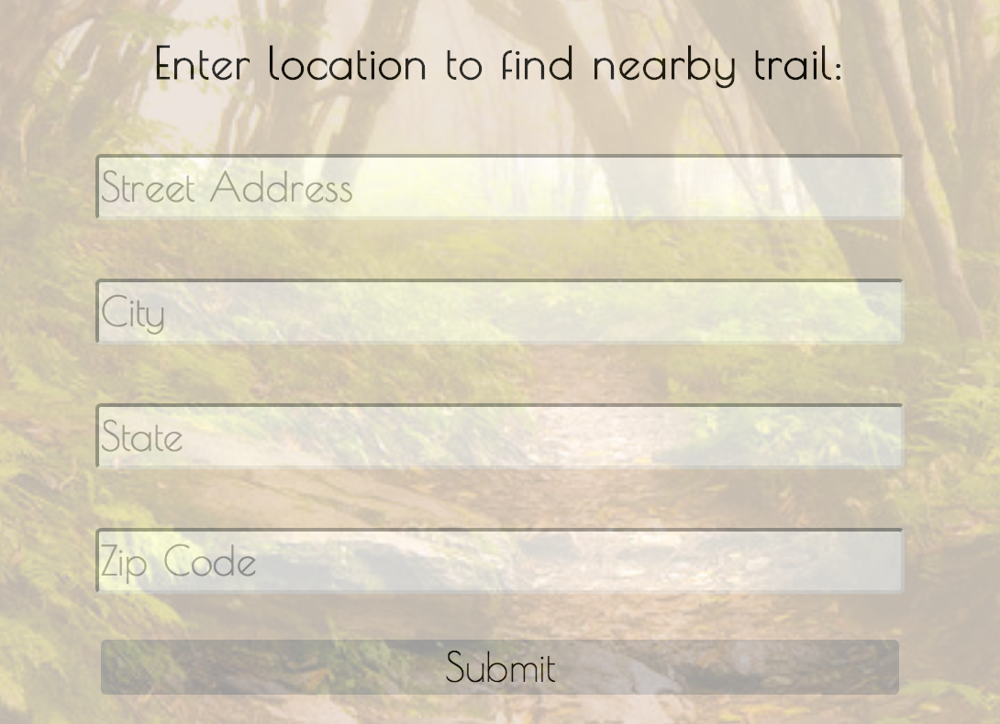
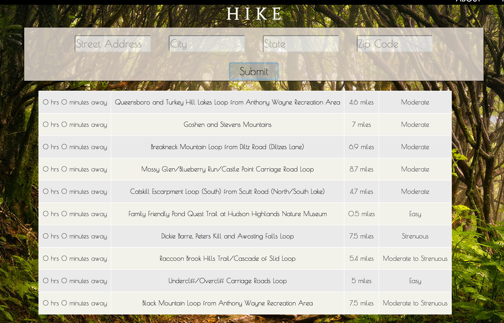
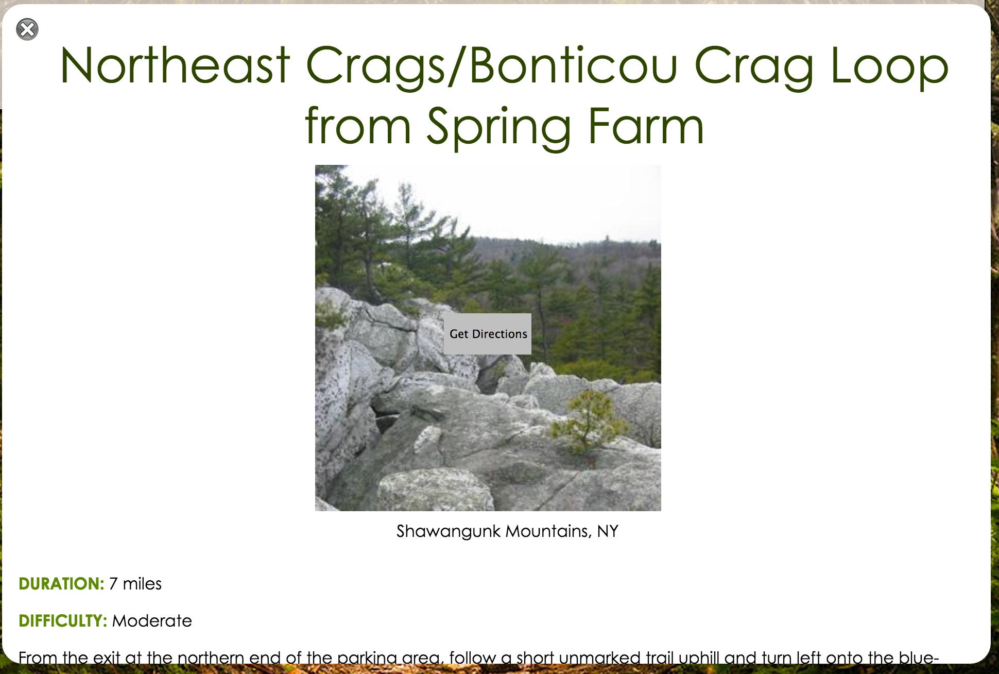

The Nomads

Annie Bae
Dave Koenig
Ian Schmertzler

========================================================

HIKE is a web application for avid hikers who want to access hike trails more easily but don’t want to deal with the logistical details. This app simplifies the planning and selection processes in hiking by showing a list of hike trails by distance, cost, difficulty, and accessibility based on modes of transportation.

========================================================

The two options on the navbar provide a brief description about the app under 'ABOUT' and a friendly hiker in 'HELLO.'

A user can enter a starting address from where they wish to depart for their hike. Once the address is submitted, a list of trails nearest you will get rendered to the page.

========================================================

Each trail name is a link that opens up a div, using javascript, with a detailed description of the chosen trail. A user can exit out of the trail's info div with the 'X' button on the top left corner, and read about more trails.

